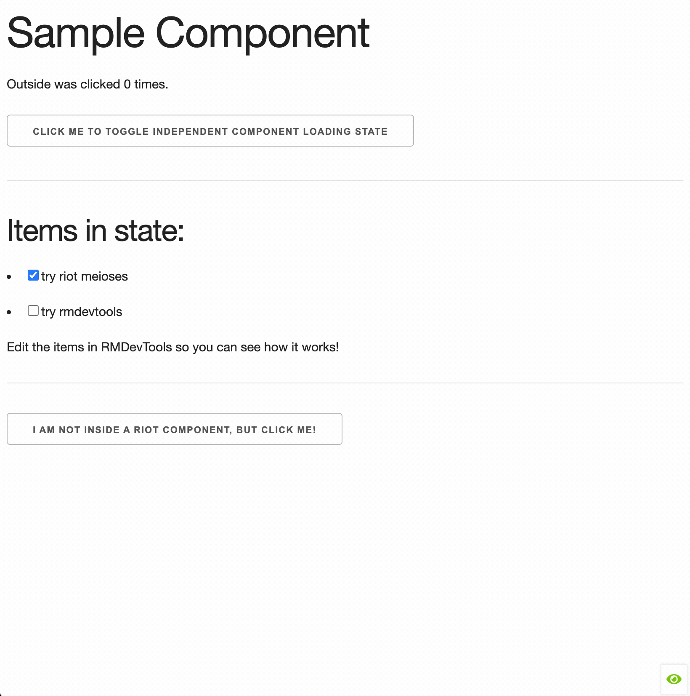

## RM Dev Tools

Riot Meiosis comes with a dev tool to be able to look into your state and manipulate it directly.




In your `app.js`
```js
import { register, component } from 'riot';
import { getStream, connect, RMDevTools } from 'riot-meiosis';

// You must pass it connect and getStream in order
// for it to return a mountable riot component
register('rmdevtools', RMDevTools({ getStream, connect }))
```

In your `app.riot` or `index.html`
```html
<html>
    ...
    <footer></footer>

    <rmdevtools></rmdevtools>
</html>

```


If you're using riot in browser compile mode and place this in your `index.html`, you need to register and mount it on your compile callback:

```html

<rmdevtools></rmdevtools>

<script>
    (async function main() {
        await riot.compile();

        riot.mount('samplecomponent');

        await riot.register(
            'rmdevtools',
            RiotMeiosis.RMDevTools(RiotMeiosis)
        );

        riot.mount('rmdevtools');

        }())
</script>

```


:::note


`rmdevtools` by default has a 3 second debounce for pushing updates when in autoSave mode.
This can be modified by adding `debounce=""` attribute to whatever you want it to be.

``` html
<rmdevtools debounce="1000"></rmdevtools>
```

Or if you want to disable it complete:

``` html
<rmdevtools debounce="0"></rmdevtools>
```

This is done to prevent blasting the stream with updates when typing, or doing modifying a large number of items, which can lead to performance issues if you're iterating over large collections or lists.

:::
